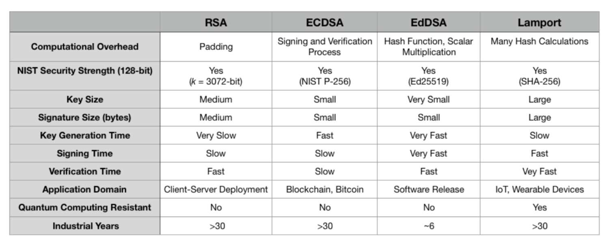
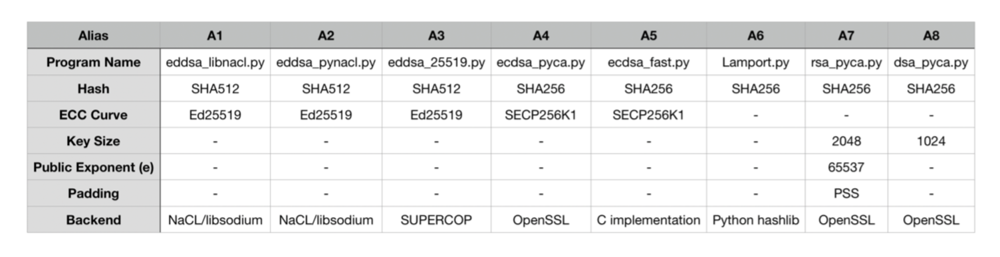

# Digital Signature Schemes Evaluation

### Install dependencies

On Linux:
```
sudo apt-get install python-dev libgmp3-dev
(OR)
sudo yum install python-devel gmp-devel
```

Required `libsodium`:
```
brew install libsodium
(OR)
sudo apt-get install libsodium23
(OR)
sudo yum install libsodium
```

Python PIP requirements:
```
pip install --user -r requirements.txt
```

### Run

- To run individual scripts:
    ```
    python [script_name].py [dataset]
    ```

- To run all scripts:
    ```
    bash runall.sh titanic.csv
    ```

### Datasets:

Datasets are acquired from the following sources:

- http://eforexcel.com/wp/downloads-18-sample-csv-files-data-sets-for-testing-sales/
- https://github.com/awesomedata/awesome-public-datasets

### Plots:





